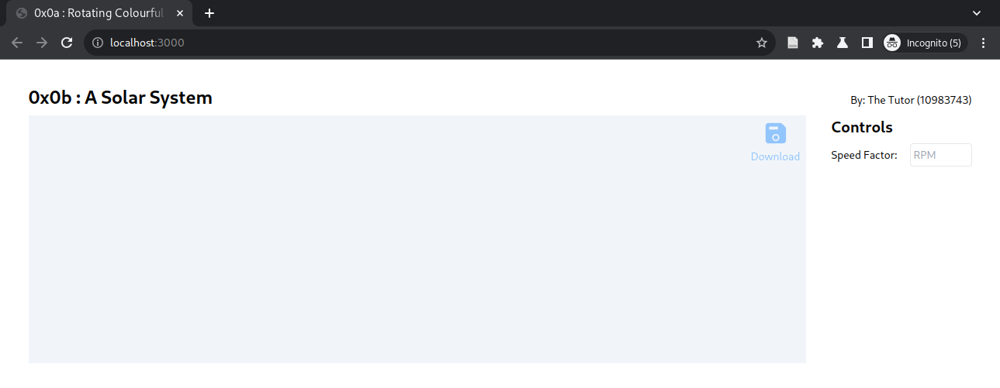

# 0x0b : Solar System #

## Assignment ##

Use the code-base from Assignment 0x0a (Rotating
Colourful Cube) to create a view of the solar system.

1. Choose any one [platonic
   solid](https://en.wikipedia.org/wiki/Platonic_solid#Cartesian_coordinates)
   for all extraterrestrial objects;
2. Create a model with at least the following:
   + A sun that rotates around its own axis;
   + An earth that rotates around its own axis and also
     around the sun (the axis tilt is upon the
     candidate's discretion to implement);
   + A moon that rotates around the earth; and
   + Another planet that rotates around the sun;
   
   (and with visually sensible colours, relative scales
   and speeds);
3. Define their relational parameters and subroutines
   to compute corresponding spatial transforms.
4. Define following UI control(s),
   + To increase (ff) or decrease (slo-mo) the
     animation speed by a scaling factor
     $\eta\in{0}\cup\{x:10^{-2}<x<5\}$, where $\eta=1$
     corresponds to $1\,\mathrm{rpm}$ for the earth to
     go around the moon;
5. Create a 15-30s short video to highlight your
   efforts.  Upload it to a streaming platform (like
   youtube) and submit *a public link*.

## Submit ##

1. Git URL
2. Commit ID
3. Teaser
4. Video Link
